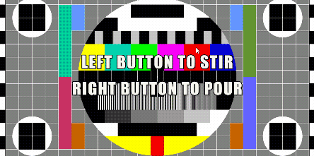

StableFluids
============

Auto recover version：

This is a straightforward GPU implementation of Jos Stam's [Stable Fluids] on
Unity.

[Stable Fluids]: http://www.dgp.toronto.edu/people/stam/reality/Research/pdf/ns.pdf

System Requirements
-------------------

- Unity 2018.1 or later

References
----------

- [Stable Fluids, Jos Stam](http://www.dgp.toronto.edu/people/stam/reality/Research/pdf/ns.pdf)
- [Real-Time Fluid Dynamics for Games, Jos Stam](https://pdfs.semanticscholar.org/847f/819a4ea14bd789aca8bc88e85e906cfc657c.pdf)
- [Fast Fluid Dynamics Simulation on the GPU, Mark J. Harris](http://developer.download.nvidia.com/books/HTML/gpugems/gpugems_ch38.html)

License
-------

[CC0](https://creativecommons.org/share-your-work/public-domain/cc0/)
